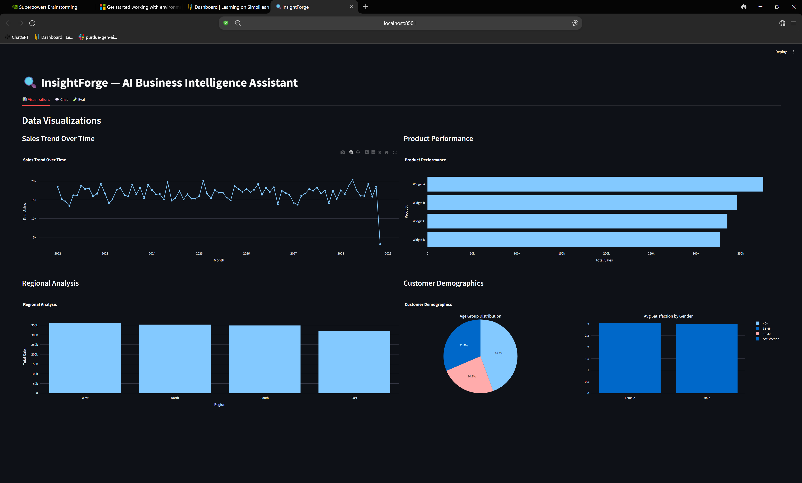
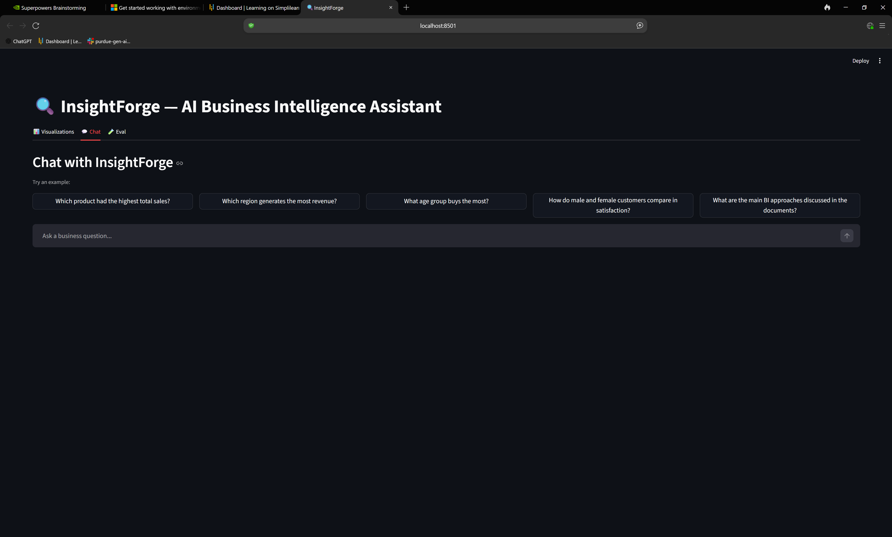
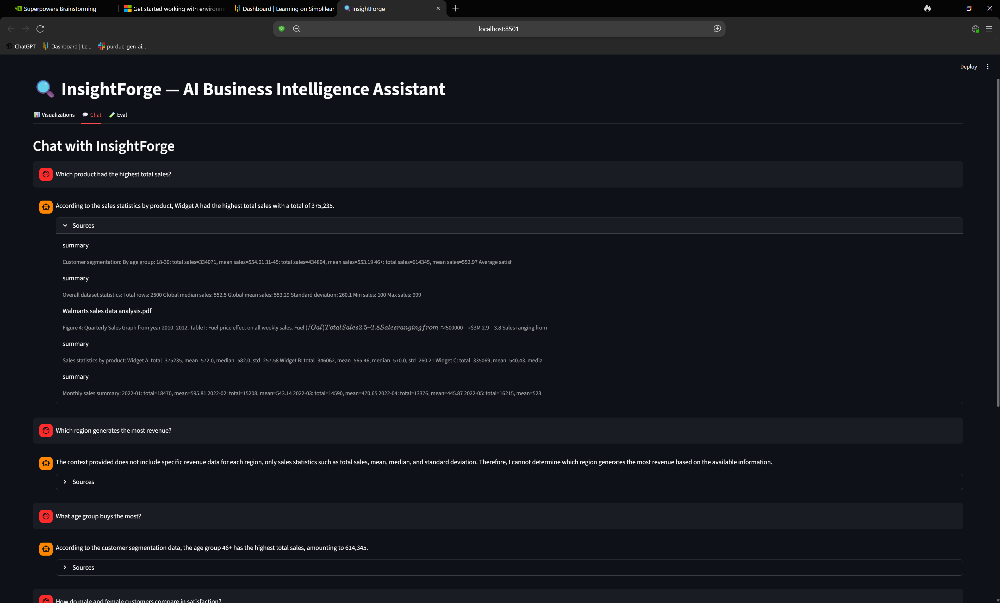
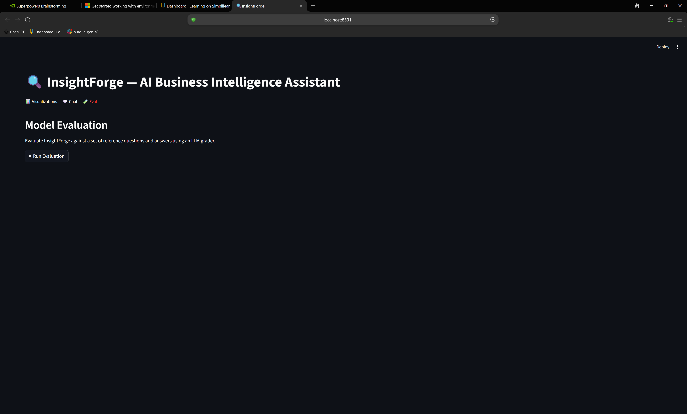
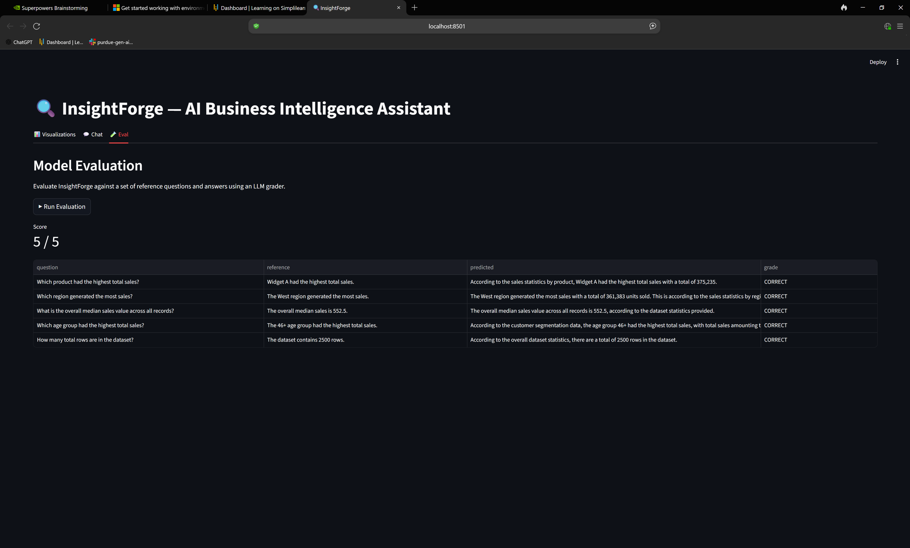

# InsightForge

AI-powered Business Intelligence Assistant. Ask natural-language questions about your sales data, explore interactive charts, and evaluate model accuracy — all in a Streamlit app backed by a RAG pipeline over CSV and PDF sources.

## Features



- **Visualizations tab** — four interactive Plotly charts (sales trend, product performance, regional breakdown, customer demographics)





- **Chat tab** — multi-turn conversation grounded in your data; answers cite their source (CSV stats or PDF document)





- **Eval tab** — one-click LLM-graded evaluation against 5 reference Q&A pairs; displays score and per-question breakdown

## Architecture

```
data/sales_data.csv  ─┐
data/pdf/*.pdf       ─┤─► src/ingestion.py ──► FAISS vector_store/
                       │        │
                       │   (row chunks + pre-aggregated summary chunks + PDF chunks)
                       │
src/chain.py ──────────┴──► build_rag_chain()  ←── app.py (Chat + Eval tabs)
src/eval.py  ──────────────► run_evaluation()  ←── app.py (Eval tab)
src/visualizations.py ─────► 4 chart functions ←── app.py (Visualizations tab)
```

**Stack:** Python 3.11+, OpenAI GPT-4o + text-embedding-ada-002, LangChain (LCEL), FAISS, Streamlit, Plotly, pandas

## Quickstart

### 1. Create and activate a virtual environment

```bash
python3 -m venv .venv
source .venv/bin/activate  # Windows: .venv\Scripts\activate
```

### 2. Install dependencies

```bash
pip install -r requirements.txt
```

### 3. Set your OpenAI API key

```bash
cp .env.example .env
# edit .env and set OPENAI_API_KEY=<your key>
```

### 4. Build the vector index

Only needed on first run or when data changes:

```bash
python src/ingestion.py
# or to force a rebuild:
REBUILD_INDEX=1 python src/ingestion.py
```

### 5. Run the app

```bash
streamlit run app.py
```

Open http://localhost:8501.

## Running tests

```bash
pytest tests/ -v
```

## Generating PDF docs

Requires [pandoc](https://pandoc.org/installing.html) and a LaTeX engine (`xelatex`):

```bash
make docs        # produces README.pdf and REPORT.pdf
make clean       # removes generated PDFs
```

19 tests covering ingestion, chain, visualizations, and eval — no API calls required (all external dependencies are mocked).

## Project structure

```
app.py                        Streamlit entry point
src/
  ingestion.py                CSV/PDF → chunks → FAISS vector store
  chain.py                    LCEL RAG chain factory (build_rag_chain)
  visualizations.py           Four Plotly chart functions
  eval.py                     QA pairs + LLM grader (run_evaluation)
tests/
  conftest.py                 Shared sample_df fixture
  test_ingestion.py           9 tests
  test_chain.py               3 tests
  test_visualizations.py      4 tests
  test_eval.py                5 tests
data/
  sales_data.csv              2500-row sales dataset
  pdf/                        Domain PDF documents
vector_store/                 Persisted FAISS index (not committed)
```

## Environment variables

| Variable | Default | Description |
|---|---|---|
| `OPENAI_API_KEY` | — | Required. Your OpenAI API key. |
| `REBUILD_INDEX` | `0` | Set to `1` to force a full re-embed on next run. |
